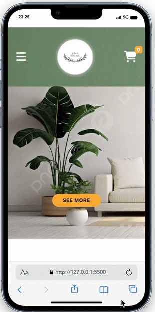

<h1> Shopping Cart</h1>

This sample shopping cart web page I have prepared;
It was created with HTML CSS and Bootstrap JavaScript codes. 

With the HTML codes in the base, the basic structure of the shopping cart application has been created.

Styles and responsive structure are given to the application with CSS codes.

With JavaScript codes, the dynamic structure of the work is completely created. 

Fetch API was used in the project. The operations performed are saved in LocalStorage. 

Visit; https://edagtorun.github.io/Shopping-Cart/

<h2>Screen Web</h2>

<h2>Screen Tablet</h2>

<h2>Screen Phone </h2>

